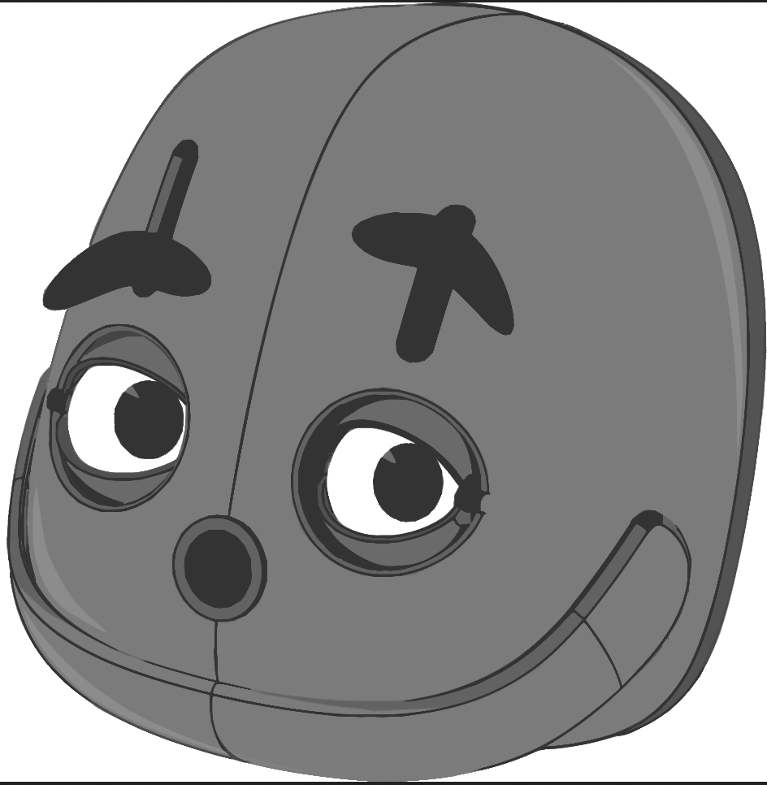
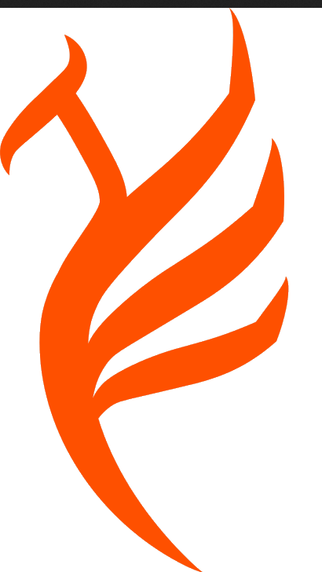

<h1 align="center">✨ Olá! Eu sou a Miriã ✨</h1>

  🎓 Estudante de Engenharia da Computação | 🤖 Entusiasta em Robótica | 🌐 Desenvolvedora Front-End & 🛠️ Back-End 

  
  
  
  
  
  
  
  
  
  
  
  

---

## 🙋‍♀️ Sobre mim

Olá! Meu nome é **Miriã Evangelista**, tenho 29 anos e atualmente sou graduanda em **Engenharia da Computação**.  

Tenho experiência prática com **Python**,**ROS2**, **FastAPI**, **Docker**, **OpenCV (cv2)**, **CvBridge**, **Numpy**, **Yasmin**, **HTML**, **CSS**, **JS**

Atualmente, participo ativamente de projetos e iniciativas acadêmicas:

- **Colaboradora** na equipe de robótica **FBOT**, o presente projeto visa contribuir para a excelência da formação curricular dos alunos. O qual culmina com a participação da equipe FURGBOT em competições nacionais e internacionais de robótica.
- 🎓 **Bolsista** no projeto **Robô Inteligente**, com foco em robótica autônoma e sistemas de tomada de decisão.  
- 🎓 **Bolsista** no projeto **CIEX**, iniciativa interinstitucional que proporcionará uma estrutura física qualificada e inovadora para a avaliação, prognóstico e mitigação de riscos de eventos extremos de inundação e estiagem, garantindo a segurança da população e das infraestruturas dos municípios às margens da Lagoa dos Patos, e possibilitando seu desenvolvimento sustentável e resiliente.

 
---

## 🤝 **Contato**

  
  

---

✨ Obrigada por visitar meu perfil! ✨

